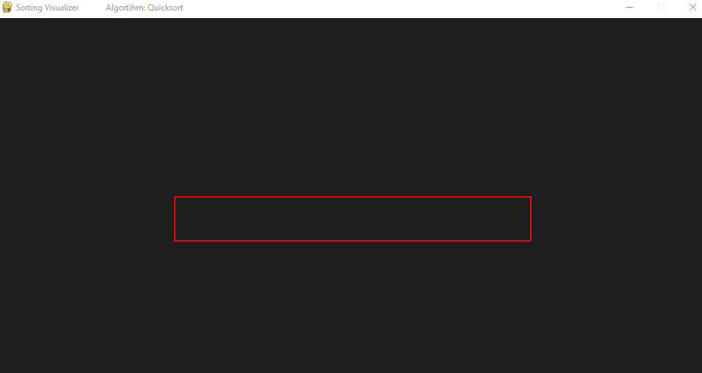

# Sorting-visualiser
Simple application for visualising sorting algorithms built with Python and Pygame

### Algorithms implemented
- Bubble sort
- Coctail sort
- Comb sort
- Cycle sort
- Gnome sort
- Heapsort
- Insertion sort
- Merge sort
- Pigeonhole sort
- Quicksort
- Radix sort
- Selection Sort
- Shellsort

### Program preview

### Additional feature
|Pause and Play with \<SPACE\>|
|---|

### Usage
- clone GitHub repository 
- Install: ``pip install pygame`` 
- Run: ``python visualizer.py``
