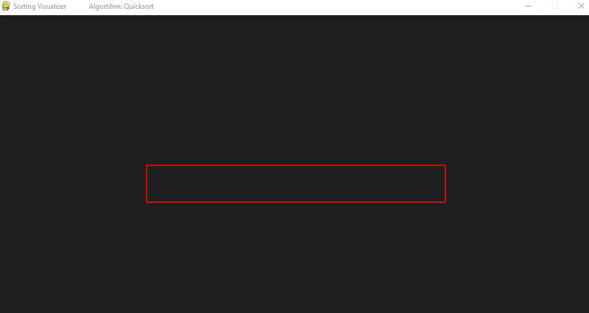

# Sorting-visualiser
Simple application for visualising sorting algorithms built with Python and Pygame

## Algorithms implemented
- Bubble sort
- Coctail sort
- Comb sort
- Cycle sort
- Gnome sort
- Heapsort
- Insertion sort
- Merge sort
- Pigeonhole sort
- Quicksort
- Radix sort
- Selection Sort
- Shellsort

## Program preview

## Features
Pause and Play with SPACE

